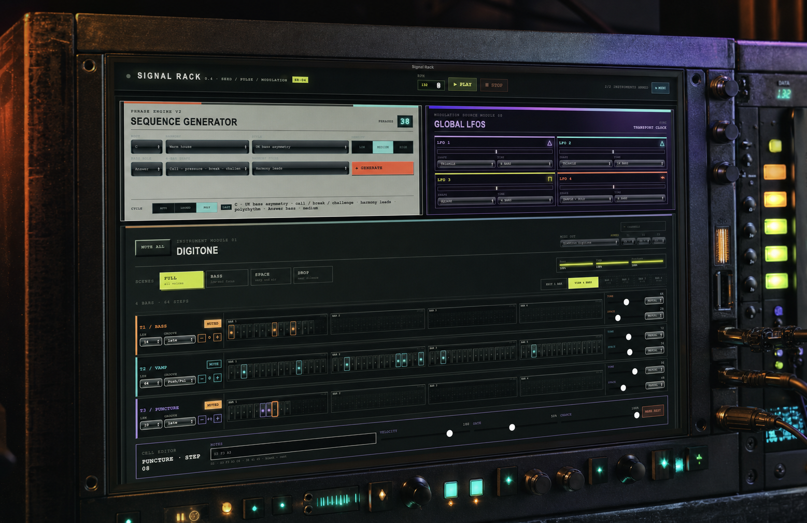

<p align="center">
  
</p>

# Signal Rack

Signal Rack is a desktop MIDI sketching environment for Elektron Digitone and Digitakt. A small set of musical choices produces a coordinated four-bar idea across both instruments, which can then be reshaped, edited, and performed without turning the application into a DAW.

React renders the rack interface. Rust owns phrase generation, MIDI clocking, modulation, event scheduling, and native MIDI output through Tauri.

## What is in the rack

- **Phrase Generator** creates related bass, harmony, puncture, and drum material from root, harmony, style, energy, four-bar shape, phrase leader, and cycle choices.
- **Modulation Generator** provides eight clock-synced LFOs. Standard waveforms, sample-and-hold, and editable drawn curves can be routed to supported parameters from a quarter note through 128 bars.
- **Euclidean Generator** applies one of twelve useful Euclidean rhythms—or a custom hit, step, and rotation combination—to a single Digitone or Digitakt lane.
- **Arpeggio Generator** applies phrase-aware pitch classes to one Digitone lane, with octave range, direction, repetition, and trigger-placement controls.
- **Scene Generator** provides eight coordinated density states for both instruments: Full, Core, Bass, Space, Tops, Drums, Melody, and Drop.
- **Digitone** has bass, chord/vamp, and puncture lanes with editable notes, groove, probability, octave, cutoff, delay, and LFO routing.
- **Digitakt** has kick, snare, closed-hat, open-hat, rimshot, clap, and texture lanes with editable trigs, groove, probability, cutoff, delay, and LFO routing.

Every lane can hold 64 steps. **Edit 1 Bar** provides detailed 16-step editing, while **View 4 Bars** shows the complete phrase and lets any step be opened directly.

## Download

Installers are available from [GitHub Releases](https://github.com/nrobin24/signal-rack/releases). Choose the Windows x64 installer or Apple Silicon DMG.

These early builds are unsigned, so Windows SmartScreen or macOS Gatekeeper may ask for confirmation. The macOS build has received the most hardware testing; Windows support should still be considered early.

## Run from source

```bash
npm install
npm run test:e2e:install
npm run dev
```

Development requires Node.js, the stable Rust toolchain, Tauri's platform prerequisites, and the Xcode command-line tools on macOS.

Useful commands:

```bash
npm run dev                       # Vite + native Tauri window
npm run check                     # TypeScript, Rust, and frontend build
npm test                          # Rust unit tests + browser E2E tests
npm run test:e2e                  # React UI against a mocked Tauri boundary
npm run midi:ports                # Scan native MIDI outputs
npm run clock:bench -- 132 6      # Measure clock timing at 132 BPM for 6 seconds
npm run build                     # Build the desktop application
```

Pushing a version tag such as `v0.4.0` builds Windows x64 and Apple Silicon installers in a draft GitHub Release.

## Hardware setup

The transport and tempo are global. Digitone and Digitakt each have a MIDI-output and channel panel, and either instrument can operate by itself. Once a device has been selected, its setup panel collapses to keep the rack compact.

### Digitone

1. Connect Digitone over USB MIDI and select it in the Digitone setup panel.
2. Match synth tracks 1–3 to the configured channels; defaults are channels 1, 2, and 3.
3. Enable note reception and `MIDI CONFIG > PORT CONFIG > RECEIVE CC/NRPN`.

Signal Rack addresses cutoff and delay using Elektron's documented MIDI parameters. Digitone octave, cutoff, and delay can each remain manual or use one of the eight modulation sources with an independent depth.

Cell editors accept MIDI numbers (`38 41 45`) or scientific note names (`D2 F2 A2`). An empty note field creates a rest.

### Digitakt

1. Load Sounds on tracks 1–7 in this order: kick, snare, closed hat, open hat, rimshot, clap, and texture.
2. Select Digitakt and match those tracks to channels 1–7.
3. Enable note reception.

Signal Rack sends MIDI note 60 to each track channel, playing the Sound already loaded on that track. It does not transfer samples or replace the Digitakt project.

In Detail view, the main pad surface toggles a trig and the smaller **Edit** control opens velocity, gate, and probability without changing the trig state.

## Musical workflow

Choose a phrase direction and press **Generate**. The phrase engine writes a related 64-step proposition across all ten lanes:

- Digitone receives bass motifs, extended chord movement, upper-register punctures, groove, probability, and starting parameter values.
- Digitakt receives related kick, backbeat, hat, percussion, and texture parts across the same four-bar form.

The available phrase shapes are A–A′–B–turn, question/answer, event/consequence/space/return, and call/pressure/break/challenge. The phrase leader determines which musical family carries the development while the other roles support it.

The **Cycle** choice controls loop relationships. **Locked** keeps all lanes on 64 steps, **Auto** gives one supporting Digitone voice a shorter cycle, and **Poly** uses two independent Digitone cycles while retaining a four-bar phrase leader.

After generation, use the lane generators for targeted changes, Scene Generator for coordinated density changes, and lane or instrument mutes for manual performance.

## Generator Lab

Generator Lab is a focused hardware-listening mode for improving the generator with structured human feedback.

1. Define one goal and hypothesis.
2. Freeze a blind batch of 6–12 candidates.
3. Audition each candidate for one cycle, two cycles, or continuously.
4. Record Keep, Maybe, or Reject.
5. Optionally rate Pitch, Groove, Step Placement, and Development for the full rack or individual musical roles.
6. Export the session as JSON for analysis.

Candidate settings remain concealed until a verdict is recorded. Bad ratings can include one standardized cause, while freeform notes remain available for anything the scorecard does not capture.

**Export Session** opens a native Save As dialog, defaulting to Documents and remembering the most recent folder within the batch. Signal Rack warns before ending, leaving, reloading, or closing with unexported session changes.

## Architecture and testing

The frontend sends typed Tauri commands for output discovery, routing, rack configuration, transport, macro changes, phrase generation, and Generator Lab export. Rust keeps the authoritative sequencer state and emits step, modulation-level, and stopped events to the interface.

The native engine provides:

- Absolute-deadline 24-PPQN MIDI clocking with synchronized transport messages.
- Per-lane groove offsets, probability, velocity, gate scheduling, mutes, and note releases.
- Shared-port or separate-port Digitone and Digitakt routing.
- Cutoff, delay, and Digitone octave modulation.
- Deterministic harmony, motif, and rhythm generation for all ten lanes.

The Playwright suite runs the real React interface against a mocked Tauri boundary, so browser tests never send notes to hardware. Rust tests cover generation, timing, LFO waveforms, clock periods, and value clamping. Use the native development window for actual MIDI validation.

## Current scope

Signal Rack is a playable multi-instrument sketch system. Its core rule is to generate a specific musical proposition quickly, then expose a small set of useful editing and performance controls.

Not included yet:

- A/B parts or automatic derivation of a second section.
- General pattern saving and recall or MIDI-file export.
- MIDI input recording.
- Digitone/Digitakt Sound selection or sample management.
- Full hardware parameter editors.

See [ROADMAP.md](ROADMAP.md) for the planned generator-repair loop, additional instruments, A/B arrangements, and generated parameter gestures.
